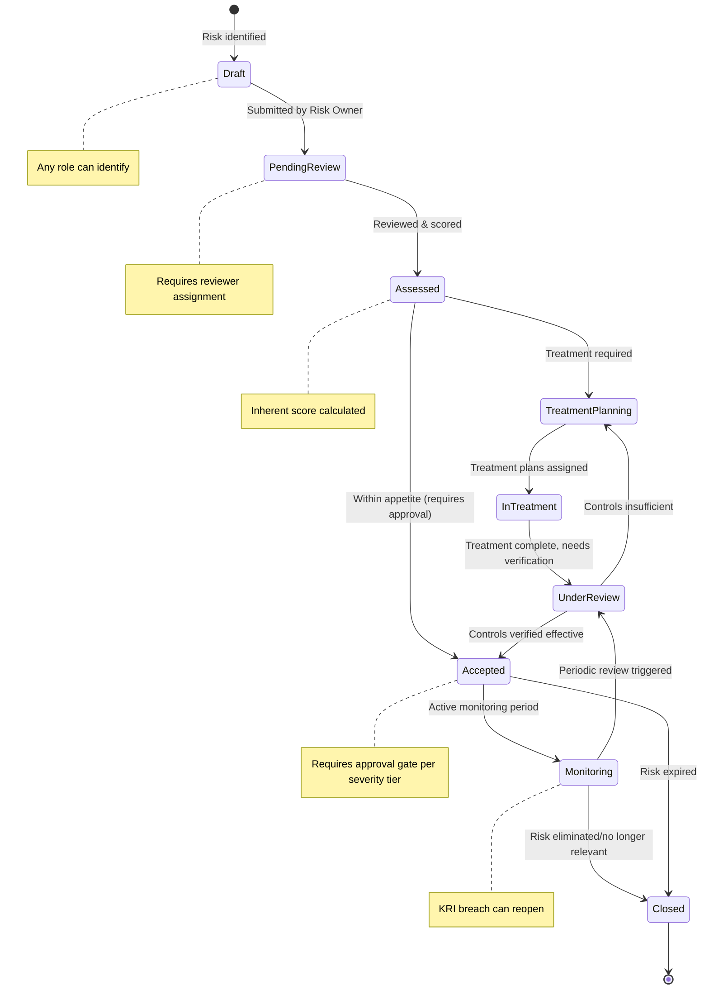
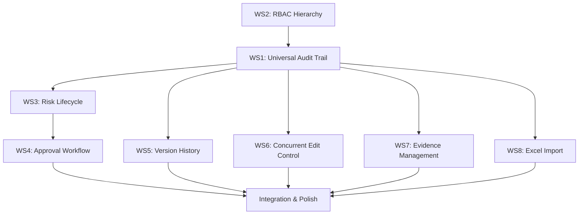

# GRC Wisdom — Complete Enterprise Risk Management Module
## Comprehensive Implementation Plan

> **Methodology**: This plan is grounded in research across ISO 31000:2018 (Risk Management), COSO ERM 2017 (Integrating with Strategy and Performance), SOC 2 Trust Services Criteria (CC7.2/CC8.1), and ISO 27001:2022 Annex A (A.5.28/A.8.9). Every gap was verified against the actual codebase, not spec documents.

---

## Part 1 — Current State Analysis

### What Actually Works Today

| Capability | Status | Evidence |
|:---|:---:|:---|
| Authentication (login/signup/JWT) | ✅ Real | `server.ts` L340-403 — real JWT signing, password verification |
| Risk CRUD (create/read/update/delete) | ✅ Real | `server.ts` L576-638 — protected endpoints, API calls from DataContext |
| 3-Stage Scoring Pipeline (IRS → CR → RRS → Post-Treatment) | ✅ Real | `server.ts` L530-572 — all 4 compute functions wired server-side |
| Control Library CRUD | ✅ Real | `server.ts` L679-731, `ControlLibrary.tsx` |
| Treatment Plan CRUD | ✅ Real | `server.ts` L733-785, `TreatmentMonitor.tsx` |
| Asset Register CRUD + Excel/CSV Import | ✅ Real | `AssetRegister.tsx` L100-223 — ExcelJS-based, actually reads file |
| Report Generation (role-based) | ✅ Partial | `server.ts` L474-527 — definitions + audit trail, no real file export |
| Dashboard with Heatmap | ✅ Real | `Dashboard.tsx` — but recomputes scores locally |
| 6-Role Type System | ✅ Defined | `roles.ts` — clean union type with all 6 roles |

### What Is Completely Missing (Every Gap)

| # | Gap | Severity | Affects |
|:---|:---|:---:|:---|
| **G1** | **No audit trail anywhere** — edits overwrite state directly with zero history | 🔴 Critical | Every module. SOC 2 CC7.2/CC8.1, ISO 27001 A.5.28 |
| **G2** | **No version history / snapshots** — cannot reconstruct "what did the register look like on date X" | 🔴 Critical | Risk Register, auditor requests |
| **G3** | **No approval workflow** — edits apply immediately, "Approved" is not a protected state | 🔴 Critical | Risk governance, audit artifact integrity |
| **G4** | **No risk lifecycle state machine** — status is a free-text-equivalent field with no enforced transitions | 🟡 High | ISO 31000 process compliance |
| **G5** | **RBAC not enforced at server level** — scattered `if` checks, no centralized permission matrix | 🟡 High | SOC 2 logical access, every module |
| **G6** | **No concurrent edit control** — two users editing same risk = last-write-wins, silent data loss | 🟡 High | Multi-user data integrity |
| **G7** | **No evidence management** — cannot attach files/screenshots/logs to a specific risk or control | 🟡 High | SOC 2 evidence requirements, audit |
| **G8** | **No risk register Excel import** — asset import works, but risk import path does not exist | 🔴 Critical | Client migration path |
| **G9** | **No risk appetite/tolerance framework** — no configurable thresholds, no breach detection | 🟡 Medium | COSO ERM Performance component |
| **G10** | **No risk categories/taxonomy** — `categoryId` exists but has no backing data or UI | 🟡 Medium | ISO 31000 Context & Criteria |
| **G11** | **KRIs are client-side-only mock data** — not persisted, not linked to risks via API | 🟡 Medium | KRI monitoring, breach escalation |
| **G12** | **Documents are client-side-only mock data** — no persistence, fake upload | 🟡 Medium | Governance documentation |
| **G13** | **Frontend recomputes scores locally** — Dashboard, RiskRegister, RiskDetail all re-derive IRS/CR/RRS independently | 🟡 Medium | Data consistency, performance |
| **G14** | **No real report export** — export endpoint returns JSON, no PDF/Excel generation | 🟡 Low | Reporting, board presentations |
| **G15** | **No automated/scheduled report generation** — no periodic risk summary capability | 🟡 Low | COSO ERM Information & Reporting |

---

## Part 2 — The Complete Risk Management Lifecycle

This is how the module must work end-to-end, per ISO 31000 and COSO ERM:



**Every transition in this diagram must**:
1. Record WHO made the transition (user ID + name)
2. Record WHEN (ISO timestamp)
3. Record WHY (mandatory note for Accepted/Closed/Rejected)
4. Create a snapshot of the full record state
5. Be subject to role-based permission checks

---

## Part 3 — Role Hierarchy & Permission Matrix

### 3.1 Role Hierarchy (Organization-Scale)

The tool serves an **organization**, not 2-3 people. The hierarchy reflects real enterprise GRC structures:

```
Level 6 ─── Administrator
              │ Full system access, user management, org configuration
Level 5 ─── CRO / Executive  
              │ Enterprise-wide risk oversight, approve Critical/High risks
Level 4 ─── Compliance Officer
              │ Cross-functional compliance review, approve Medium risks
Level 3 ─── Risk Owner
              │ Own and manage assigned risks, create treatment plans
Level 2 ─── Internal Auditor
              │ Read-only access to everything, can create audit findings
Level 1 ─── Read-Only / Board Viewer
              │ Dashboard and report access only
```

### 3.2 Permission Matrix (RACI-Based)

| Action | Administrator | CRO/Exec | Compliance | Risk Owner | Auditor | Board Viewer |
|:---|:---:|:---:|:---:|:---:|:---:|:---:|
| **View Dashboard** | ✅ | ✅ | ✅ | ✅ | ✅ | ✅ |
| **View Risk Register** | ✅ | ✅ | ✅ | ✅ (own) | ✅ | ✅ |
| **Create Risk** | ✅ | ✅ | ✅ | ✅ | ❌ | ❌ |
| **Edit Risk** | ✅ | ✅ | ✅ | ✅ (own) | ❌ | ❌ |
| **Delete Risk** | ✅ | ❌ | ❌ | ❌ | ❌ | ❌ |
| **Submit Risk for Review** | ✅ | ✅ | ✅ | ✅ | ❌ | ❌ |
| **Approve Critical Risk** | ✅ | ✅ | ❌ | ❌ | ❌ | ❌ |
| **Approve High Risk** | ✅ | ✅ | ✅ | ❌ | ❌ | ❌ |
| **Approve Moderate/Low Risk** | ✅ | ✅ | ✅ | ✅ | ❌ | ❌ |
| **Create/Edit Controls** | ✅ | ✅ | ✅ | ✅ | ❌ | ❌ |
| **Create/Edit Treatments** | ✅ | ✅ | ✅ | ✅ | ❌ | ❌ |
| **Upload Evidence** | ✅ | ✅ | ✅ | ✅ | ✅ | ❌ |
| **View Audit Log** | ✅ | ✅ | ✅ | ❌ | ✅ | ❌ |
| **Import from Excel** | ✅ | ✅ | ❌ | ❌ | ❌ | ❌ |
| **Export Reports** | ✅ | ✅ | ✅ | ✅ | ✅ | ✅ |
| **Manage Users** | ✅ | ❌ | ❌ | ❌ | ❌ | ❌ |
| **View All Notifications** | ✅ | ✅ | ✅ | Own only | ✅ | ❌ |

---

## Part 4 — Detailed Implementation Workstreams

### Workstream 1: Universal Audit Trail (Gaps G1, G2)
*SOC 2 CC7.2/CC8.1 · ISO 27001 A.5.28 · COSO ERM Information & Reporting*

**Principle**: Every mutation to any entity in the system — risk, control, treatment, asset, KRI, user, document — creates an immutable audit record. This is not optional. This is the single most important gap to close.

#### What Gets Audited

Every audit entry records:
- **Who**: User ID, name, role at time of action
- **What**: Entity type, entity ID, action type, field-by-field changes (old value → new value)
- **When**: ISO 8601 timestamp (server-generated, not client-supplied)
- **Where**: IP address, user agent (from request headers)
- **Why**: Optional note (mandatory for approval/rejection/closure actions)

#### Data Model Addition to `server.ts` DB

```typescript
// Added to the DB object
auditLog: {
  id: string;
  entityType: 'risk' | 'control' | 'treatment' | 'asset' | 'kri' | 'document' | 'user' | 'mapping';
  entityId: string;
  entityCode?: string;        // e.g., "RSK-001" for human readability
  action: 'create' | 'update' | 'delete' | 'approve' | 'reject' | 'submit' |
          'status_change' | 'import' | 'export' | 'login' | 'lock' | 'unlock';
  userId: string;
  userName: string;
  userRole: string;
  ipAddress?: string;
  userAgent?: string;
  note?: string;              // Mandatory for approve/reject/close
  fieldChanges: {
    field: string;
    oldValue: any;
    newValue: any;
  }[];
  snapshotId?: string;        // Links to the snapshot created by this action
  timestamp: string;          // Server-generated ISO 8601
}[];

// Snapshots for point-in-time reconstruction
snapshots: {
  id: string;
  entityType: string;
  entityId: string;
  version: number;            // Auto-incrementing per entity
  data: any;                  // Full JSON snapshot of the entity at this point
  createdBy: string;
  createdAt: string;
  trigger: string;            // What caused this snapshot: 'edit', 'approve', 'import', 'status_change'
}[];
```

#### API Endpoints

| Method | Endpoint | Purpose | Allowed Roles |
|:---|:---|:---|:---|
| GET | `/api/v1/audit-log` | List all audit entries (filterable) | Admin, CRO, Compliance, Auditor |
| GET | `/api/v1/audit-log?entityType=risk&entityId=:id` | Audit history for specific entity | Admin, CRO, Compliance, Auditor |
| GET | `/api/v1/audit-log?userId=:id` | All actions by a specific user | Admin, Auditor |
| GET | `/api/v1/:entityType/:id/history` | Version history for an entity | All authenticated |
| GET | `/api/v1/:entityType/:id/snapshots/:version` | Specific point-in-time snapshot | All authenticated |
| GET | `/api/v1/audit-log/export` | Export audit log as CSV | Admin, Auditor |

#### Implementation in `server.ts`

A centralized `createAuditEntry()` function wraps every mutation:

```typescript
function createAuditEntry(
  entityType: string, entityId: string, entityCode: string | undefined,
  action: string, user: { id: string; name: string; role: string },
  oldRecord: any | null, newRecord: any | null,
  req: any, note?: string
) {
  // 1. Compute field-level diff
  const fieldChanges = computeFieldDiff(oldRecord, newRecord);
  
  // 2. Create snapshot (new version)
  const version = getNextVersion(entityType, entityId);
  const snapshotId = createSnapshot(entityType, entityId, version, newRecord, user.id, action);
  
  // 3. Create audit entry
  const entry = {
    id: generateId(),
    entityType, entityId, entityCode, action,
    userId: user.id, userName: user.name, userRole: user.role,
    ipAddress: req.ip || req.headers['x-forwarded-for'],
    userAgent: req.headers['user-agent'],
    note,
    fieldChanges,
    snapshotId,
    timestamp: new Date().toISOString()
  };
  
  DB.auditLog.unshift(entry); // Most recent first
  return entry;
}
```

**Every existing endpoint** (`POST /risks`, `PUT /risks/:id`, `DELETE /risks/:id`, and equivalents for controls, treatments, assets) gets wrapped with this function. No exceptions.

#### Frontend Components

##### Audit History Panel (reusable component)
- Chronological timeline showing every change to an entity
- Each entry shows: user avatar + name, timestamp, action type, expandable field-level diff
- Filterable by action type, date range, user
- Accessible from: RiskDetail, ControlLibrary (per control), TreatmentMonitor (per plan), AssetRegister (per asset)

##### Global Audit Log Page (new page at `/audit-log`)
- System-wide audit trail view
- Filterable by entity type, user, date range, action type
- Exportable to CSV
- Only visible to Admin, CRO/Executive, Compliance Officer, Internal Auditor

---

### Workstream 2: RBAC Role Hierarchy (Gap G5)
*SOC 2 Logical Access · ISO 27001 A.5.15/A.8.3*

#### Current Problem

RBAC is enforced via scattered `if` checks in `server.ts`:
```typescript
// This pattern is repeated ~12 times with slight variations
if ((req as any).user.role === "Internal Auditor") {
  return res.status(403).json({ error: "..." });
}
```

This is:
- Easy to forget on new endpoints
- Not centralized — a missed check = a security hole
- Not granular — cannot express "Risk Owner can edit own risks but not others"

#### Solution: Centralized Permission Middleware

##### [roles.ts](file:///d:/Download%20folder/grc-wisdom1.1/src/types/roles.ts) Additions

```typescript
// Role hierarchy levels (higher = more permissions)
export const ROLE_LEVELS: Record<Role, number> = {
  "Administrator": 6,
  "CRO / Executive": 5,
  "Compliance Officer": 4,
  "Risk Owner": 3,
  "Internal Auditor": 2,
  "Read-Only / Board Viewer": 1,
};

// Actions the system recognizes
export type Permission =
  | 'risk:create' | 'risk:read' | 'risk:update' | 'risk:delete'
  | 'risk:approve_critical' | 'risk:approve_high' | 'risk:approve_moderate'
  | 'risk:submit' | 'risk:import'
  | 'control:create' | 'control:read' | 'control:update' | 'control:delete'
  | 'treatment:create' | 'treatment:read' | 'treatment:update' | 'treatment:delete'
  | 'asset:create' | 'asset:read' | 'asset:update' | 'asset:delete'
  | 'evidence:upload' | 'evidence:read' | 'evidence:delete'
  | 'audit:read' | 'audit:export'
  | 'report:generate' | 'report:export' | 'report:schedule'
  | 'user:manage' | 'user:read';

// Permission matrix
export const ROLE_PERMISSIONS: Record<Role, Permission[]> = {
  "Administrator": [/* all permissions */],
  "CRO / Executive": ['risk:create', 'risk:read', 'risk:update', 'risk:submit',
    'risk:approve_critical', 'risk:approve_high', 'risk:approve_moderate',
    'risk:import', /* ... most permissions except user:manage, risk:delete */],
  "Compliance Officer": ['risk:create', 'risk:read', 'risk:update', 'risk:submit',
    'risk:approve_high', 'risk:approve_moderate', /* ... */],
  "Risk Owner": ['risk:create', 'risk:read', 'risk:update', 'risk:submit',
    'risk:approve_moderate', /* ... */],
  "Internal Auditor": ['risk:read', 'control:read', 'treatment:read', 'asset:read',
    'evidence:upload', 'evidence:read', 'audit:read', 'audit:export',
    'report:generate', 'report:export'],
  "Read-Only / Board Viewer": ['risk:read', 'control:read', 'treatment:read',
    'report:generate', 'report:export'],
};
```

##### Server-Side Middleware (`server.ts`)

```typescript
// Replace 12 scattered if-checks with:
const requirePermission = (...permissions: Permission[]) => (req: any, res: any, next: any) => {
  const userRole = req.user?.role;
  const userPermissions = ROLE_PERMISSIONS[userRole] || [];
  
  const hasPermission = permissions.some(p => userPermissions.includes(p));
  if (!hasPermission) {
    createAuditEntry('system', 'access_denied', undefined, 'access_denied', req.user, null, null, req);
    return res.status(403).json({
      error: `Your role (${userRole}) does not have permission for this action.`,
      required: permissions,
    });
  }
  next();
};

// Usage:
app.post("/api/v1/risks", authenticateToken, requirePermission('risk:create'), (req, res) => { ... });
app.put("/api/v1/risks/:id", authenticateToken, requirePermission('risk:update'), (req, res) => { ... });
app.delete("/api/v1/risks/:id", authenticateToken, requirePermission('risk:delete'), (req, res) => { ... });
```

##### Frontend Permission Helper

```typescript
// In DataContext or a new usePermissions hook
export function usePermissions() {
  const { currentRole } = useData();
  const can = (permission: Permission) => ROLE_PERMISSIONS[currentRole]?.includes(permission) ?? false;
  return { can, currentRole };
}

// Usage in components:
const { can } = usePermissions();
if (can('risk:create')) { /* show Create button */ }
if (can('risk:approve_critical')) { /* show Approve button for critical risks */ }
```

---

### Workstream 3: Risk Lifecycle State Machine (Gap G4)
*ISO 31000 Process · COSO ERM Performance*

#### Current State

Status is a free-form string from a union type: `'Open' | 'In Progress' | 'Closed' | 'Under Review'`. There are no enforced transitions, no timestamps per transition, and no approval gates.

#### Target State Machine

| State | Entry Condition | Exit Conditions | Who Can Transition |
|:---|:---|:---|:---|
| **Draft** | Risk created | → Pending Review (submit) | Risk Owner, Admin, CRO, Compliance |
| **Pending Review** | Submitted for assessment | → Assessed (reviewer assigns scores) | Admin, CRO, Compliance |
| **Assessed** | Scores assigned | → Treatment Planning (needs mitigation) or → Pending Approval (within appetite) | Admin, CRO, Compliance |
| **Treatment Planning** | Mitigation needed | → In Treatment (plans assigned & started) | Risk Owner, Admin |
| **In Treatment** | Active treatment | → Under Review (treatment complete) | Risk Owner, Admin |
| **Under Review** | Treatment verification | → Accepted (effective), → Treatment Planning (insufficient) | Admin, CRO, Compliance |
| **Pending Approval** | Needs formal acceptance | → Accepted (approved), → Rejected (needs revision) | Per severity-tier |
| **Accepted** | Formally accepted | → Monitoring (active watch), → Closed (expired) | Admin, CRO |
| **Monitoring** | Active risk monitoring | → Under Review (periodic or KRI breach), → Closed | System/Admin |
| **Closed** | Risk resolved | Terminal state (can be reopened to Draft) | Admin, CRO, Compliance |

#### Data Model Additions

```typescript
// Added to each risk record
statusHistory: {
  fromStatus: string;
  toStatus: string;
  changedBy: string;       // userId
  changedByName: string;
  changedAt: string;       // ISO timestamp
  note?: string;           // Mandatory for Accepted, Rejected, Closed
}[];

approvalStatus: 'none' | 'pending' | 'approved' | 'rejected';
approvedBy?: string;
approvedAt?: string;
rejectedBy?: string;
rejectedAt?: string;
rejectedReason?: string;
pendingChanges?: object;   // Staged edits for approved risks (see Workstream 4)

currentReviewerId?: string;  // Who is assigned to review this risk
reviewDueDate?: string;
lastReviewedAt?: string;

// Lifecycle timestamps
identifiedAt: string;      // When status first became Draft
assessedAt?: string;        // When scoring was completed
treatmentStartedAt?: string;
acceptedAt?: string;
closedAt?: string;
```

#### Transition Enforcement API

```typescript
// New endpoint for status transitions
app.post("/api/v1/risks/:id/transition", authenticateToken, (req, res) => {
  const { targetStatus, note } = req.body;
  const risk = findRisk(req.params.id);
  
  // Validate transition is allowed from current state
  const validTransitions = STATE_TRANSITIONS[risk.status];
  if (!validTransitions?.includes(targetStatus)) {
    return res.status(400).json({
      error: `Cannot transition from "${risk.status}" to "${targetStatus}"`,
      validTargets: validTransitions,
    });
  }
  
  // Check role permission for this transition
  if (!canTransition(req.user.role, risk.status, targetStatus, risk)) {
    return res.status(403).json({
      error: `Your role cannot perform this transition`,
    });
  }
  
  // Require note for terminal/approval transitions
  if (['Accepted', 'Closed', 'Rejected'].includes(targetStatus) && !note) {
    return res.status(400).json({ error: 'A note is required for this transition' });
  }
  
  // Execute transition
  const oldStatus = risk.status;
  risk.status = targetStatus;
  risk.statusHistory.push({
    fromStatus: oldStatus, toStatus: targetStatus,
    changedBy: req.user.id, changedByName: req.user.name,
    changedAt: new Date().toISOString(), note
  });
  
  // Set lifecycle timestamps
  if (targetStatus === 'Assessed') risk.assessedAt = new Date().toISOString();
  if (targetStatus === 'In Treatment') risk.treatmentStartedAt = new Date().toISOString();
  if (targetStatus === 'Accepted') risk.acceptedAt = new Date().toISOString();
  if (targetStatus === 'Closed') risk.closedAt = new Date().toISOString();
  
  // Audit
  createAuditEntry('risk', risk.id, risk.code, 'status_change', req.user,
    { status: oldStatus }, { status: targetStatus }, req, note);
  
  // Recalculate scores
  recalculateRiskScores(risk.id);
  
  res.json(risk);
});
```

---

### Workstream 4: Approval Workflow Engine (Gap G3)
*SOC 2 CC8.1 · ISO 27001 A.5.1*

#### How It Works

1. **New risks** start as `Draft` — editable freely
2. **Submitted risks** (`Pending Review`) — reviewer assigned based on severity tier
3. **When a risk reaches approval stage**: system looks at risk level, determines minimum approver role:
   - **Critical** (score > 80) → requires CRO/Executive or Administrator
   - **High** (score 51-80) → requires Compliance Officer or above
   - **Moderate** (score 21-50) → requires Risk Owner or above
   - **Low** (score ≤ 20) → any authorized role
4. **Editing an Accepted risk** → changes are staged in `pendingChanges`, risk enters `Pending Approval`, original remains visible until approved
5. **Approval** → merges `pendingChanges` into main record, creates snapshot, audit entry
6. **Rejection** → clears `pendingChanges`, requires reason, creates audit entry

#### API Endpoints

| Method | Endpoint | Purpose |
|:---|:---|:---|
| POST | `/api/v1/risks/:id/submit` | Submit Draft → Pending Review |
| POST | `/api/v1/risks/:id/approve` | Approve risk (with note) |
| POST | `/api/v1/risks/:id/reject` | Reject risk (with mandatory reason) |
| GET | `/api/v1/approvals/pending` | All risks awaiting approval |
| GET | `/api/v1/approvals/pending?role=:role` | Pending approvals for a specific role tier |
| GET | `/api/v1/approvals/history` | Approval/rejection history |

#### Frontend: Approval Queue Dashboard

New UI components on:
- **RiskDetail page**: Shows approval status badge, pending changes diff, approve/reject buttons (visible only to authorized roles)
- **Dashboard**: "Pending Approvals" card showing count and list for the current user's role
- **RiskRegister**: Approval status column, "Pending Review" filter tab

---

### Workstream 5: Version History & Snapshots (Gap G2)
*SOC 2 CC7.2 · ISO 27001 A.5.28*

This is tightly coupled with Workstream 1 (Audit Trail). Every audit entry that represents a mutation also creates a snapshot.

#### Point-in-Time Reconstruction

Auditors will ask: "Show me what the risk register looked like on March 15, 2025."

The snapshot system supports this:
```typescript
GET /api/v1/register-snapshot?date=2025-03-15T00:00:00Z

// Returns: for each risk, the latest snapshot <= the requested date
// This reconstructs the full register as it was at that point in time
```

#### Frontend: Version History Tab

On the **RiskDetail** page, a new "History" tab shows:
- Timeline of all versions (v1, v2, v3...)
- Side-by-side diff view between any two versions
- "Restore to this version" button (creates a new version, not a destructive rewrite)
- Point-in-time view: shows the complete risk record as it was at that snapshot

---

### Workstream 6: Concurrent Edit Control (Gap G6)

#### Mechanism: Optimistic Locking + Edit Sessions

```typescript
// Each mutable entity gets a version counter
risk.version = 1;  // Increments on every save

// When a user starts editing:
POST /api/v1/locks
{ entityType: "risk", entityId: "r1" }
// Returns: { lockId, expiresAt (5 min), heldBy: { userId, name } }

// When saving, client sends:
PUT /api/v1/risks/:id
Headers: { "If-Match": "3" }  // Expected version

// Server checks:
// 1. Is this user the lock holder? (or lock expired)
// 2. Does the version match? If not → 409 Conflict
//    Response includes current record so user can merge
```

#### Frontend Behavior

- When entering edit mode: UI acquires lock, shows "Editing..." indicator
- If another user holds lock: shows banner "Currently being edited by [Name] since [Time]"
- If lock expires during edit: warning toast, attempt re-acquire
- On save with version conflict: modal showing "This record was modified by [Name]. Review changes and try again."
- On navigate away without saving: release lock automatically

---

### Workstream 7: Evidence Management (Gap G7)
*SOC 2 CC6.1 · ISO 27001 A.5.33*

#### Data Model

```typescript
evidence: {
  id: string;
  entityType: 'risk' | 'control' | 'treatment' | 'asset';
  entityId: string;
  fileName: string;
  fileSize: number;
  mimeType: string;
  description?: string;
  uploadedBy: string;       // userId
  uploadedByName: string;
  uploadedAt: string;       // ISO timestamp
  base64Data: string;       // In-memory storage (for dev; production → S3/blob)
}[];
```

#### API Endpoints

| Method | Endpoint | Purpose |
|:---|:---|:---|
| POST | `/api/v1/evidence` | Upload evidence (multipart/form-data) |
| GET | `/api/v1/evidence?entityType=risk&entityId=:id` | List evidence for an entity |
| GET | `/api/v1/evidence/:id/download` | Download an evidence file |
| DELETE | `/api/v1/evidence/:id` | Remove evidence (audited) |

#### Frontend: Evidence Tab

On **RiskDetail**, **ControlLibrary** (per control), **TreatmentMonitor** (per plan):
- File upload dropzone (drag & drop or click-to-browse)
- Evidence list showing: filename, size, uploader name, upload date, description
- Download and delete actions (with audit trail)
- Supported formats: PDF, DOCX, XLSX, PNG, JPG, CSV

---

### Workstream 8: Excel Import for Risk Register (Gap G8)
*Client migration critical path*

#### How It Works

The asset register import (which actually works — it uses ExcelJS to parse real files) serves as the proven pattern. We replicate that pattern for risks:

1. **Download Template**: Client gets an `.xlsx` template with correct headers, data validation dropdowns, and example rows
2. **Upload & Validate**: Server reads every row, validates field types, ranges, enum values
3. **Preview & Confirm**: Frontend shows import preview — valid rows in green, invalid in red with error messages
4. **Import with Audit Trail**: Each imported risk gets a `create` audit entry with `trigger: 'import'` and a snapshot

#### Risk Column Mapping

| Excel Column | Maps To | Validation |
|:---|:---|:---|
| Risk Title* | `title` | Required, max 200 chars |
| Description* | `description` | Required |
| Likelihood* | `likelihood` | Integer 1-5 |
| Impact* | `impact` | Integer 1-5 |
| CIA - Confidentiality | `cia_c` | Integer 1-5, default 3 |
| CIA - Integrity | `cia_i` | Integer 1-5, default 3 |
| CIA - Availability | `cia_a` | Integer 1-5, default 3 |
| Status | `status` | Enum: Draft, Open, In Progress, Under Review, Closed |
| Category | `categoryId` | Must match existing category |
| Risk Owner | `ownerId` | Must match existing user email/name |
| Root Cause | `rootCause` | Free text |
| Treatment Strategy | `treatmentStrategy` | Enum: Accept, Mitigate, Transfer, Avoid |
| Target Date | `targetDate` | Valid date format |
| Service Tower | `serviceTower` | Free text |
| Comments | `comments` | Free text |

#### API Endpoints

| Method | Endpoint | Purpose |
|:---|:---|:---|
| GET | `/api/v1/risks/import/template` | Download Excel template |
| POST | `/api/v1/risks/import/validate` | Validate file without importing |
| POST | `/api/v1/risks/import` | Import validated file |

#### Import Result Response

```json
{
  "imported": 15,
  "skipped": 3,
  "total": 18,
  "errors": [
    { "row": 4, "field": "likelihood", "message": "Value '7' is out of range (1-5)" },
    { "row": 8, "field": "ownerId", "message": "User 'john@company.com' not found" }
  ],
  "auditEntryId": "audit-12345"
}
```

---

## Part 5 — File Change Map

| File | Workstreams | Change Type |
|:---|:---:|:---|
| [server.ts](file:///d:/Download%20folder/grc-wisdom1.1/server.ts) | 1,2,3,4,5,6,7,8 | HEAVY MODIFY — audit infrastructure, permission middleware, state machine, approval endpoints, locking, evidence, import |
| [roles.ts](file:///d:/Download%20folder/grc-wisdom1.1/src/types/roles.ts) | 2 | MODIFY — add ROLE_LEVELS, Permission type, ROLE_PERMISSIONS matrix |
| [index.ts](file:///d:/Download%20folder/grc-wisdom1.1/src/types/index.ts) | 1,3,5,7 | MODIFY — extend Risk interface with lifecycle fields, add AuditEntry, Snapshot, Evidence types |
| [DataContext.tsx](file:///d:/Download%20folder/grc-wisdom1.1/src/store/DataContext.tsx) | 1,2,3,4,6,7 | MODIFY — add audit, approval, lock, evidence actions; add usePermissions hook |
| [RiskDetail.tsx](file:///d:/Download%20folder/grc-wisdom1.1/src/pages/RiskDetail.tsx) | 1,3,4,5,6,7 | HEAVY MODIFY — add History tab, Approval panel, Evidence tab, Lock UI, Version diff |
| [RiskRegister.tsx](file:///d:/Download%20folder/grc-wisdom1.1/src/pages/RiskRegister.tsx) | 3,8 | MODIFY — add approval status column, Pending Approvals filter, Import button |
| [NewRisk.tsx](file:///d:/Download%20folder/grc-wisdom1.1/src/pages/NewRisk.tsx) | 3,6 | MODIFY — add Draft/Submit workflow, lock acquisition on edit |
| [ControlLibrary.tsx](file:///d:/Download%20folder/grc-wisdom1.1/src/pages/ControlLibrary.tsx) | 1,7 | MODIFY — add audit history per control, evidence tab |
| [TreatmentMonitor.tsx](file:///d:/Download%20folder/grc-wisdom1.1/src/pages/TreatmentMonitor.tsx) | 1 | MODIFY — add audit history per treatment |
| [AssetRegister.tsx](file:///d:/Download%20folder/grc-wisdom1.1/src/pages/AssetRegister.tsx) | 1 | MODIFY — add audit history per asset |
| [Dashboard.tsx](file:///d:/Download%20folder/grc-wisdom1.1/src/pages/Dashboard.tsx) | 3,13 | MODIFY — add Pending Approvals card, read scores from API instead of local compute |
| [ReportsView.tsx](file:///d:/Download%20folder/grc-wisdom1.1/src/pages/ReportsView.tsx) | 14 | MODIFY — add real Excel export using ExcelJS + file-saver |
| [Layout.tsx](file:///d:/Download%20folder/grc-wisdom1.1/src/components/Layout.tsx) | 1 | MODIFY — add "Audit Log" nav item |
| [App.tsx](file:///d:/Download%20folder/grc-wisdom1.1/src/App.tsx) | 1 | MODIFY — add `/audit-log` route |
| **NEW** [AuditLog.tsx](file:///d:/Download%20folder/grc-wisdom1.1/src/pages/AuditLog.tsx) | 1 | NEW — global audit log page |
| **NEW** [AuditTimeline.tsx](file:///d:/Download%20folder/grc-wisdom1.1/src/components/AuditTimeline.tsx) | 1 | NEW — reusable audit history timeline component |
| **NEW** [ApprovalPanel.tsx](file:///d:/Download%20folder/grc-wisdom1.1/src/components/ApprovalPanel.tsx) | 4 | NEW — approval status + action component |
| **NEW** [EvidencePanel.tsx](file:///d:/Download%20folder/grc-wisdom1.1/src/components/EvidencePanel.tsx) | 7 | NEW — evidence upload/list component |
| **NEW** [ImportDialog.tsx](file:///d:/Download%20folder/grc-wisdom1.1/src/components/ImportDialog.tsx) | 8 | NEW — Excel import modal with validation preview |
| **NEW** [VersionDiff.tsx](file:///d:/Download%20folder/grc-wisdom1.1/src/components/VersionDiff.tsx) | 5 | NEW — side-by-side version comparison component |
| **NEW** [auditService.ts](file:///d:/Download%20folder/grc-wisdom1.1/src/services/auditService.ts) | 1 | NEW — API client for audit endpoints |
| **NEW** [permissionService.ts](file:///d:/Download%20folder/grc-wisdom1.1/src/services/permissionService.ts) | 2 | NEW — permission checking utilities |

---

## Part 6 — Implementation Order & Dependencies



**Phase 1**: WS2 (RBAC) → WS1 (Audit Trail) — foundation everything builds on
**Phase 2**: WS3 (Lifecycle) + WS5 (Versioning) — can run in parallel
**Phase 3**: WS4 (Approval) — depends on WS3
**Phase 4**: WS6 (Locking) + WS7 (Evidence) + WS8 (Import) — independent of each other
**Phase 5**: Integration testing, Dashboard updates, frontend polish

---

## Part 7 — Verification Plan

### Per-Workstream Acceptance Criteria

| WS | Test | How to Verify |
|:---|:---|:---|
| 1 | Every mutation creates audit entry | Create/edit/delete a risk → check `/api/v1/audit-log` shows entry with who/what/when/field changes |
| 1 | Snapshot created on every edit | Edit a risk 3 times → GET `/api/v1/risks/:id/history` returns 3 snapshots |
| 2 | Permission enforcement | Login as Board Viewer → attempt POST `/api/v1/risks` → expect 403 |
| 2 | Type safety | Run `npx tsc --noEmit` → no role-related type errors |
| 3 | State transitions enforced | Attempt to transition Draft → Closed directly → expect 400 error |
| 3 | Timestamps recorded | Transition through full lifecycle → verify each `statusHistory` entry has timestamp |
| 4 | Severity-tier approval | Create Critical risk → attempt approve as Risk Owner → expect 403; approve as CRO → expect 200 |
| 4 | Staged edits on approved risks | Edit an Accepted risk → verify changes are in `pendingChanges`, not applied directly |
| 5 | Point-in-time reconstruction | Create 3 risks at different times → query register snapshot for middle date → only first 2 returned |
| 6 | Lock prevents concurrent edit | User A acquires lock → User B attempts edit → expect 423 Locked |
| 6 | Version conflict detected | User A saves with version=2, but version=3 exists → expect 409 Conflict |
| 7 | Evidence attached with metadata | Upload file to risk → verify timestamp, uploader name, file size recorded |
| 8 | Excel import reads real data | Upload `.xlsx` with 5 risks → verify all 5 appear in register with correct field values |
| 8 | Import validation catches errors | Upload file with invalid likelihood=7 → verify error reported, row not imported |

### End-to-End Scenario: Full Risk Lifecycle

1. **Risk Owner** logs in, creates risk "Data Center Fire" → status: `Draft`, audit entry created
2. **Risk Owner** submits for review → status: `Pending Review`, audit entry
3. **Compliance Officer** reviews, assigns scores (Likelihood=4, Impact=5) → status: `Assessed`
4. System computes IRS = 60 (High) → requires CRO approval for acceptance
5. **Risk Owner** creates treatment plan "Install fire suppression" → linked to risk
6. Status: `Treatment Planning` → `In Treatment` as work progresses
7. Treatment reaches 100% → **Compliance Officer** reviews → status: `Under Review`
8. **CRO/Executive** approves → status: `Accepted`, audit entry with approval note
9. 90 days later, periodic review triggered → status: `Monitoring` → `Under Review`
10. If risk is no longer relevant → **CRO** closes → status: `Closed`, mandatory note

**At every step**: audit entry created, snapshot saved, timestamps recorded, permissions enforced.

---

## Open Questions for Your Review

> [!IMPORTANT]
> **Q1 — Risk Appetite Configuration**: Should we include a risk appetite/tolerance setup screen where org admins can define thresholds per risk category? This would enable automatic "appetite breached" detection for the KRI Breached Report.

> [!IMPORTANT]  
> **Q2 — Risk Categories/Taxonomy**: Should we build a configurable risk taxonomy (Strategic, Operational, Financial, Compliance, Reputational + custom subcategories) that replaces the current hardcoded `categoryId`?

> [!IMPORTANT]
> **Q3 — Notification System**: Should approval requests, status transitions, and KRI breaches trigger in-app notifications + optional email to the relevant person?

> [!IMPORTANT]
> **Q4 — Implementation Approach**: Should we implement all 8 workstreams sequentially (slower but safer), or start with the critical path (WS1+WS2 → WS3 → WS4) and build the rest in parallel?
